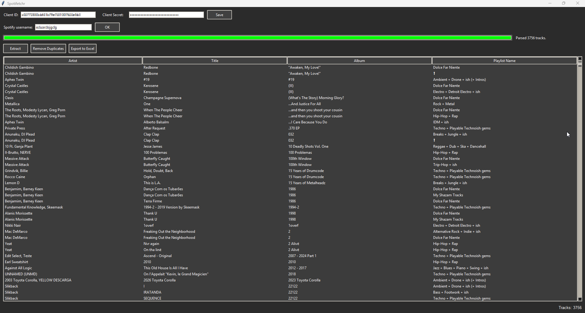
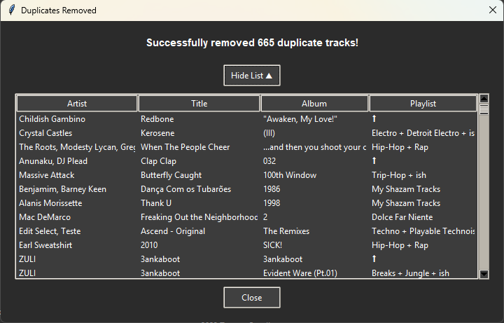

# Spotifetchr

A simple Tkinter GUI application to fetch and export tracks from a user's public Spotify playlists.



## Features

- Fetch all public playlists owned by any Spotify user
- Display tracks in a sortable table (by Artist, Title, Album, or Playlist)
- Option to export data to Excel (.xlsx)
- Option to remove duplicate tracks automatically



## Requirements

- Python 3.7+
- Required packages:
  - `spotipy`
  - `pandas`
  - `openpyxl`

## Installation

1. Install the required packages:
```bash
pip install spotipy pandas openpyxl
```

2. Get Spotify API credentials:
   - Go to [Spotify Developer Dashboard](https://developer.spotify.com/dashboard)
   - Log in with your Spotify account
   - Click "Create app"
   - Fill in the app name and description (any values work)
   - Set redirect URI to 'https://localhost:8080/callback'
   - Copy your **Client ID** and **Client Secret**

## Usage

1. Run the application:
```bash
python main.py
```

2. Enter your Spotify **Client ID** and **Client Secret** in the top fields and click **Save**
3. Enter the Spotify username of the user whose playlists you want to fetch
4. Click **Extract** to fetch all tracks from that user's public playlists
5. Use the column headers to sort the table by Artist, Title, Album, or Playlist Name
6. Click **Remove Duplicates** to automatically remove duplicate tracks (based on artist and title)
7. Click **Export to Excel** to save the current table to an .xlsx file

## Notes

- Uses Spotify's **Client Credentials Flow** (no user login required)
- Only fetches playlists **owned/created** by the specified user
- Credentials are stored in plaintext at `~/.spotifetchr.json`
- Handles Spotify API rate limiting automatically

## License

Free to use and modify.

